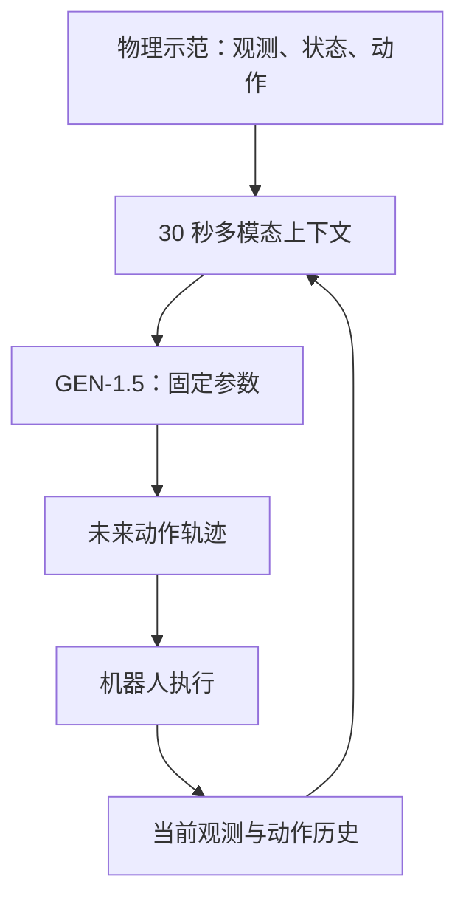

# GEN-1.5：具身基础模型中的 In-Context Learning

> **工作名称：** GEN-1.5: Embodied Foundation Models are One-Shot Learners  
> **发布机构：** Generalist AI  
> **发布时间：** 2026 年 8 月 19 日  
> **公开形式：** 官方技术博客，尚非完整同行评审论文  
> **核心关键词：** Embodied Foundation Model、In-Context Learning、Physical Prompting、One-Shot Imitation Learning、Robot Manipulation

---

# 1. 一句话概括

**GEN-1.5 是 Generalist AI 发布的具身基础模型：用户只需向机器人提供一段 3–12 秒的传感—动作示范，模型便可在不更新参数、不微调的情况下，立即尝试执行新任务。**

Generalist 将这种接口称为：

> **Physical Prompting：用传感器观测与动作轨迹构成的物理示范，作为机器人的上下文提示。**

不过必须先说明：GEN-1.5 当前公开材料是官方技术博客，而不是完整论文；模型参数量、精确网络结构、action tokenizer、训练损失、动作头和完整评测协议均未公开。因此目前适合把它视为一个重要的研究预览，而不是已经完全可复现和独立验证的工作。

- [GEN-1.5 官方技术报告](https://generalistai.com/blog/gen-1.5)

---

# 2. GEN-1.5 的核心能力

官方公布的主要结果如下。

| 能力 | 设置 | 官方结果 |
| --- | --- | ---: |
| One-shot in-context learning | 单条 3–12 秒示范，0 次梯度更新 | 10 个任务平均成功率 59% ± 10% |
| Few-step adaptation | 5 分钟数据，约 50 条示范，10 次梯度更新 | 83% ± 9% |
| Extreme few-step adaptation | 1 分钟数据，1 次梯度更新 | 66.5% |
| Prompt composition | 两个独立物理提示拼接 | 可以连续完成两个子任务 |
| Sim-to-real prompting | 仿真示范作为 prompt | 真实机器人直接执行 |
| Human-to-robot prompting | 人手演示 | 机器人尝试复现 |
| Physical generalization | 新位置、物体、工具、左右手 | 能改变轨迹和操作策略 |

测试任务主要是简单、短时程的灵巧操作，例如：

- 拉开笔袋拉链；
- 拧开玻璃罐盖；
- 从钱包中取出纸币；
- 将物体扫进容器；
- 移除吸尘器部件；
- 使用未在示范中出现的替代工具。

官方明确承认，目前的 59% 成功率比较有限，in-context policy 也比充分微调的 policy 更脆弱，尚不能视为工业级可靠性。

---

# 3. 从 GEN-0、GEN-1 到 GEN-1.5

理解 GEN-1.5，首先要理解 Generalist 的整体技术路线。

| 模型 | 核心目标 | 主要特征 |
| --- | --- | --- |
| GEN-0 | 证明具身模型存在 scaling law | 10B+ 模型、跨 embodiment、270,000 小时物理数据 |
| GEN-1 | 用少量任务数据达到高成功率 | 约 1 小时任务数据、部分任务成功率超过 99% |
| GEN-1.5 | 将任务适应压缩到上下文中 | 一条示范、零梯度更新、立即执行 |

GEN-0 的核心观点是：机器人基础模型可以像 LLM 一样，通过扩大模型、数据和计算量持续提高能力。其基础模型从真实物理交互数据上训练，而不是把现成 VLM 简单连接到 action head。

截至 GEN-1，官方表示预训练数据已经超过 50 万小时，主要由人类佩戴或操作低成本采集设备完成，而不是完全依靠特定机器人遥操作数据。

- [GEN-0 官方报告](https://generalistai.com/blog/gen-0)
- [GEN-1 官方报告](https://generalistai.com/blog/gen-1)

GEN-1.5 则进一步把：

$$
\text{数小时数据}+\text{数千步微调}
$$

压缩为：

$$
\text{几秒示范}+\text{一次前向推理}.
$$

它的研究意义并不主要是 59% 这个数值，而是“任务适应”开始从训练过程转移到模型的上下文窗口中。

---

# 4. GEN-1.5 的输入、输出和整体数据流

官方披露 GEN-1.5 是一个大型多模态模型，能够处理：

- 视频；
- 机器人本体状态 proprioception；
- 传感器信息；
- 动作历史；
- 可选语言信息；
- 物理示范；
- 当前在线观测。

模型拥有约 30 秒的时间上下文，并输出 100 Hz 动作轨迹。

需要注意：

> “输出 100 Hz action trajectories”不一定意味着大型模型每秒完整前向推理 100 次，也可能是模型低频生成 action chunk，再由底层控制器以 100 Hz 执行。官方尚未公布其真实推理频率和 action chunk 结构。

整体过程可以抽象为：

设一条示范为：

$$
D=
\left\{
(o_i^{d},s_i^{d},a_i^{d})
\right\}_{i=1}^{N},
$$

其中：

- $o_i^d$：图像或其他传感器观测；
- $s_i^d$：本体状态；
- $a_i^d$：示范动作。

机器人当前在线历史为：

$$
H_t=
\left\{
(o_j,s_j,a_j)
\right\}_{j=t-L}^{t-1}.
$$

GEN-1.5 学习的条件策略可以抽象为：

$$
p_\theta
\left(
a_{t:t+K}
\mid
D,H_t,o_t,s_t,l
\right),
$$

其中 $l$ 是可选语言条件。

关键在于：

$$
\theta_{\mathrm{test}}=\theta_{\mathrm{pretrain}},
$$

即 physical prompt 只改变模型的输入上下文，不改变模型权重。

机器人每次执行一小段动作后重新观察环境：

$$
o_{t+1}\sim P
\left(
o_{t+1}\mid o_t,a_t
\right),
$$

然后重新预测：

$$
a_{t+1:t+K+1}
\sim
p_\theta
\left(
\cdot\mid D,H_{t+1},o_{t+1}
\right).
$$

所以它不是简单地复现 demonstration trajectory，而是一个 **prompt-conditioned closed-loop policy**。

---

# 5. Physical Prompt 究竟是什么？

普通语言模型的 few-shot prompt 是：

$$
(x_1,y_1),(x_2,y_2),\dots,x_q.
$$

模型根据示例推断任务映射：

$$
x\mapsto y.
$$

GEN-1.5 的 physical prompt 则是：

$$
(o_1^d,a_1^d),
(o_2^d,a_2^d),
\dots,
(o_N^d,a_N^d).
$$

它隐式描述了三个东西。

## 5.1 任务目标是什么

例如示范最终把拉链打开，模型需要识别“打开拉链”才是目标，而不是机械复制手的位置。

## 5.2 如何与对象交互

包括抓取位置、接触关系、运动方向、力度和双手协调模式。

## 5.3 成功状态长什么样

示范末尾的视觉状态和物体状态构成一种隐式 goal specification。

因此 physical prompt 同时承担：

$$
\text{Task Specification}
+
\text{Goal Demonstration}
+
\text{Behavioral Prior}.
$$

这比单纯语言指令包含更多低层物理信息。例如，“把两块 Lego 严密扣合”很难用语言精确描述接触位置、方向和力度，但几秒钟的视频—动作示范能够直接表达。

---

# 6. In-Context Learning 的严格定义

## 6.1 基本定义

In-context learning，简称 ICL，指：

> 模型仅根据当前输入上下文中的示例改变预测行为，而不通过梯度下降修改模型参数。

训练完成后的模型为：

$$
f_{\theta^\star}.
$$

给定示例集合：

$$
D_{\mathrm{ctx}}
=
\{(x_i,y_i)\}_{i=1}^{n},
$$

对查询 $x_q$ 的预测是：

$$
\hat y_q
=
f_{\theta^\star}
\left(
D_{\mathrm{ctx}},x_q
\right).
$$

整个推理过程中：

$$
\Delta\theta=0.
$$

但由于上下文改变：

$$
f_{\theta^\star}(D_1,x_q)
\neq
f_{\theta^\star}(D_2,x_q).
$$

模型表现得像“学会了新任务”，实际上是固定权重网络根据不同上下文执行了不同的计算过程。

## 6.2 ICL 与其他适应方法的区别

| 方法 | 测试时是否更新权重 | 新任务信息存放位置 | 持续时间 |
| --- | ---: | --- | --- |
| In-context learning | 否 | KV cache、hidden states、context | 上下文结束后消失 |
| Fine-tuning | 是 | 模型参数 | 持久 |
| Meta-learning | 通常需要专门训练 | 元模型参数或快速适应机制 | 取决于算法 |
| Retrieval | 否 | 外部数据库 | 数据库长期存在 |
| Behavior cloning | 是 | Policy 参数 | 持久 |
| Test-time training | 是 | 临时更新后的参数 | 可临时或持久 |

因此，GEN-1.5 的两类结果其实对应两个不同机制：

$$
\underbrace{\text{3--12 秒示范，0 梯度步}}_{\text{ICL}}
$$

与：

$$
\underbrace{\text{1--5 分钟示范，1--10 梯度步}}_{\text{few-step fine-tuning / TTT}}.
$$

不能把后者也称为纯 in-context learning。

---

# 7. In-Context Learning 为什么能够工作？

目前没有一个理论可以完全解释大规模 Transformer 中的 ICL，但可以从三个互补角度理解。

## 7.1 观点一：隐式贝叶斯任务推断

假设每条序列背后存在一个隐变量 $z$，表示：

- 当前任务；
- 目标状态；
- 对象类别；
- 动力学；
- 操作策略；
- Robot embodiment；
- 环境约束。

模型在看到示范前，对任务有先验：

$$
p(z).
$$

看到 physical prompt $D$ 后，得到任务后验：

$$
p(z\mid D)
=
\frac{p(D\mid z)p(z)}
{\int p(D\mid z')p(z')\,dz'}.
$$

然后预测当前情况下的动作：

$$
p(a_t\mid o_t,D)
=
\int
p(a_t\mid o_t,z)
p(z\mid D)\,dz.
$$

对应到“打开拉链”：

- 预训练模型已经掌握很多抓取、拉动、接触、双手协调模式；
- 示范使模型的任务后验集中到“抓住 zipper tab 并沿拉链方向拉动”；
- 当前拉链位置与示范不同时，模型根据当前观测重新生成轨迹。

所以它不是从一条示范中重新学习全部操作知识，而是：

$$
\boxed{
\text{用示范识别任务}
+
\text{调用预训练技能}
+
\text{根据当前环境重新实例化}
}
$$

更准确地说，physical prompt 是在“提醒”模型它已经接近掌握的能力。

## 7.2 观点二：Transformer 在前向过程中执行隐式梯度下降

考虑一个简化的线性策略：

$$
a=W\phi(o),
$$

其中 $\phi(o)$ 是状态特征。

给定示范：

$$
D=\{(\phi_i,a_i)\}_{i=1}^{N},
$$

示范损失为：

$$
\mathcal L_D(W)
=
\frac{1}{2}
\sum_i
\|W\phi_i-a_i\|_2^2.
$$

如果显式微调一次：

$$
W'
=
W_0-\eta\nabla_W\mathcal L_D(W_0),
$$

则：

$$
W'
=
W_0
-
\eta
\sum_i
(W_0\phi_i-a_i)\phi_i^\top.
$$

查询状态的输出为：

$$
\hat a_q=W'\phi_q.
$$

部分理论研究发现，Transformer 的 attention 和 MLP 可以在一次前向传播中近似完成这种计算：

$$
(D,\phi_q)
\longrightarrow
\hat W(D)\phi_q.
$$

这里的 $\hat W(D)$ 不是实际写入模型参数的权重，而是一种存在于 hidden state 中的“临时策略”。

因此可以将 ICL 理解为：

$$
\boxed{
\text{固定模型权重}
+
\text{上下文诱导的虚拟参数更新}
}
$$

但需要注意，这一结论主要在简化线性回归和受控 Transformer 中得到理论证明，不能直接断言 GEN-1.5 内部真的执行标准梯度下降。

- [Transformers Learn In-Context by Gradient Descent](https://arxiv.org/abs/2212.07677)
- [Why Can GPT Learn In-Context? Language Models as Meta-Optimizers](https://arxiv.org/abs/2212.10559)

## 7.3 观点三：Attention 完成状态—动作匹配和模式延续

Self-attention 的基本形式为：

$$
Q=HW_Q,\qquad
K=HW_K,\qquad
V=HW_V,
$$

$$
\operatorname{Attn}(H)
=
\operatorname{softmax}
\left(
\frac{QK^\top}{\sqrt{d}}
\right)V.
$$

在机器人 ICL 中，可以抽象地理解为：

- 当前观测形成 query；
- demonstration 中的观测形成 keys；
- demonstration 中的动作、目标和交互信息形成 values。

于是当前状态可以检索示范中语义或几何上相关的阶段：

$$
\alpha_{qi}
=
\operatorname{softmax}
\left(
\frac{q_q^\top k_i}{\sqrt d}
\right),
$$

$$
h_q'
=
\sum_i \alpha_{qi}v_i.
$$

但多层 attention 做的不只是最近邻复制。它可能逐层抽取：

$$
\text{物体对应关系}
\rightarrow
\text{任务目标}
\rightarrow
\text{当前进度}
\rightarrow
\text{动作策略}.
$$

例如示范中杯子位于左侧，当前杯子位于右侧，模型不能复制绝对关节轨迹，而要识别：

$$
\text{marker}\rightarrow\text{cup}
$$

这一关系，再根据新的相对位置生成不同运动。

机器人 ICL 的已有公开工作 ICRT 也采用 causal Transformer 对 sensorimotor trajectory 进行 autoregressive next-token prediction，并通过输入示范执行未见任务，这为 GEN-1.5 所采用的基本范式提供了可复现的先例。

- [In-Context Imitation Learning via Next-Token Prediction（ICRT）](https://arxiv.org/abs/2408.15980)

---

# 8. GEN-1.5 中 ICL 可能是怎样形成的？

## 8.1 预训练任务

官方表示，GEN-1.5 从大量连续物理活动片段中随机采样序列，优化 next-action prediction。

可以概念性地写为：

$$
\mathcal L_{\mathrm{pretrain}}
=
-\sum_t
\log
p_\theta
\left(
a_t
\mid
o_{\leq t},
s_{\leq t},
a_{<t},
l
\right).
$$

如果使用连续动作回归，也可能表现为：

$$
\mathcal L_{\mathrm{act}}
=
\sum_t
\left\|
a_t-\hat a_t
\right\|_2^2.
$$

但 GEN-1.5 没有公布最终使用的是离散 action token、连续分布、diffusion、flow matching，还是混合动作头，因此上式只是统一抽象。

## 8.2 训练数据具有时间聚集性

自然物理工作并不是独立同分布的数据。

例如一次真实整理任务中可能连续出现：

$$
\text{抓取盒子}
\rightarrow
\text{打开盒子}
\rightarrow
\text{拿取物品}
\rightarrow
\text{再次打开另一个盒子}.
$$

相近技能会在局部时间段内重复出现，这称为 **burstiness**。

同时，任务频率往往接近长尾或 Zipf 分布：

- 少数动作非常常见；
- 大量任务很少出现；
- 同一动作在不同对象和环境中反复出现。

研究表明，burstiness、长尾类别和动态任务含义能够促使 Transformer 形成 ICL，而不仅仅把所有知识固化到参数中。

- [Data Distributional Properties Drive Emergent In-Context Learning in Transformers](https://arxiv.org/abs/2205.05055)

GEN-1.5 官方提出的假设正是：

$$
\text{大规模物理序列}
+
\text{局部重复}
+
\text{长尾活动}
+
\text{next-action prediction}
$$

可能使模型学会：

> 先从前面的轨迹判断“现在在做什么”，再继续生成符合该活动的动作。

## 8.3 它没有显式 Meta-Learning

传统 one-shot imitation learning 通常会构造：

$$
D_{\mathrm{support}}
+
D_{\mathrm{query}},
$$

并显式优化：

$$
\theta^\star
=
\arg\min_\theta
\mathbb E_z
\left[
\mathcal L
\left(
f_\theta(D_z^{\mathrm{support}},x_z^{\mathrm{query}}),
y_z^{\mathrm{query}}
\right)
\right].
$$

也就是说，训练阶段明确要求模型“根据 support demonstration 解决 query task”。

GEN-1.5 官方声称没有：

- Support/query episode construction；
- MAML 的 inner loop/outer loop；
- 专门的 ICL auxiliary loss；
- 手工将多条示范打包进 context；
- 专门设计用于 ICL 的架构修改。

它只在自然连续物理序列上进行预训练。测试时插入的 physical prompt 甚至包含训练时未见过的时间跳跃：示范结束后突然切换到新场景。

因此官方将它称为 **emergent ICL**。

但“没有显式训练 ICL”不等于“预训练没有间接训练相同能力”。只要训练数据中经常出现根据前序动作判断当前活动的需求，next-action prediction 就会持续奖励这种能力。

---

# 9. GEN-1.5 不是简单的轨迹复制

假设示范轨迹是：

$$
\tau^d
=
\{x_0^d,a_0^d,\dots,x_T^d,a_T^d\}.
$$

最简单的 replay policy 是：

$$
a_t=a_t^d.
$$

这在初始位置发生变化时会立即失败。

真正的 in-context policy 应学习条件映射：

$$
\pi_\theta
\left(
a_t
\mid
x_t,\tau^d
\right).
$$

它至少需要分离：

$$
\tau^d
\rightarrow
\underbrace{g}_{\text{任务目标}}
+
\underbrace{\sigma}_{\text{行为策略}}
+
\underbrace{\text{trajectory details}}_{\text{示范实例}}.
$$

然后在新状态 $x_t$ 下求：

$$
a_t
\sim
\pi_\theta(a_t\mid x_t,g,\sigma).
$$

官方展示的以下现象支持它不只是 replay：

- 物体初始位置变化后仍能操作；
- 失败后能够重新抓取；
- 会换手；
- 能产生 demonstration 中没有的过渡动作；
- 两个 prompt 拼接时能生成 regrasp 和 reposition；
- 能用香蕉或 dustpan 替代刷子。

不过，目前这些主要还是官方视频和案例。缺少以下严格消融：

- 打乱示范动作后是否失效；
- 只给首尾视觉帧是否同样有效；
- 只给视频、不提供动作是否有效；
- 提供错误终点是否跟随错误目标；
- Demonstration 与预训练最近邻的距离；
- 改变 prompt 顺序是否改变组合任务顺序；
- Prompt retrieval baseline；
- Trajectory replay/retargeting baseline。

所以目前可以说这些现象“支持 goal-level inference”，但还不能完全排除强大的相似任务检索和轨迹重定向。

---

# 10. Physical Prompt Composition

给定两个相互独立的示范：

$$
D_A:\text{打开笔袋},
$$

$$
D_B:\text{从笔袋中取出纸币},
$$

组合上下文：

$$
D=[D_A;D_B].
$$

模型执行：

$$
\pi_\theta(\cdot\mid D)
\Rightarrow
A\rightarrow B.
$$

值得注意的是，两条示范之间没有演示完整过渡过程。模型需要自行生成：

$$
\text{打开笔袋}
\rightarrow
\text{重新定位手}
\rightarrow
\text{寻找纸币}
\rightarrow
\text{抓取并取出}.
$$

因此可以将其看成物理世界中的 skill composition：

$$
\pi_{A\circ B}
\approx
\operatorname{Compose}
\left(
\pi_A,\pi_B
\right).
$$

但目前只能证明有限的两段式 composition，还不能说明它能稳定组合任意技能或者处理复杂依赖，例如：

- $B$ 的前置状态与 $A$ 的终止状态不兼容；
- 两个 prompt 对同一个物体给出冲突目标；
- 组合顺序包含循环和条件分支；
- 长任务超过 30 秒上下文；
- 子任务失败后需要重新规划。

---

# 11. Sim-to-Real 和 Human-to-Robot ICL 为什么重要？

## 11.1 Sim-to-Real Physical Prompting

传统 sim-to-real 通常是：

$$
\text{模拟器中训练 policy}
\rightarrow
\text{真实机器人直接部署}.
$$

GEN-1.5 展示的是：

$$
\text{仿真示范}
\rightarrow
\text{作为 context 输入固定模型}
\rightarrow
\text{真实机器人执行}.
$$

即：

$$
p_\theta
(a_t^{\mathrm{real}}
\mid
D^{\mathrm{sim}},o_t^{\mathrm{real}}).
$$

官方表示其预训练数据不包含仿真数据，因此模型需要忽略：

- 渲染风格差异；
- 机器人手形状差异；
- 仿真动力学差异；

保留：

- 对象关系；
- 目标状态；
- 接触策略；
- 动作语义。

这说明 physical prompt 可能不仅是像素级匹配，而是形成了某种跨域的行为表示。

## 11.2 Human-to-Robot ICL

更极端的情况是：

$$
D^{\mathrm{human}}
\rightarrow
\pi^{\mathrm{robot}}.
$$

此时 human hand 与 robot hand 的 action space 不一致：

$$
\mathcal A_{\mathrm{human}}
\neq
\mathcal A_{\mathrm{robot}}.
$$

如果模型仍能完成任务，意味着它可能抽取了 embodiment-independent representation：

$$
\text{human trajectory}
\rightarrow
\text{object-centric goal/interaction}
\rightarrow
\text{robot action}.
$$

但是 GEN-1.5 没有披露 human demonstration 中是否还包含手持夹爪状态、动作估计、3D tracking 或其他结构化信号，因此尚不能确定这种跨 embodiment 对齐是如何实现的。

---

# 12. GEN-1.5 的真正创新在哪里？

它的重点可能不是一个独立的新网络模块，而是以下因素达到一定规模后的组合：

$$
\boxed{
\text{超大规模真实物理数据}
+
\text{大容量多模态时序模型}
+
\text{长传感—动作上下文}
+
\text{统一 next-action prediction}
}
$$

具体而言：

1. **任务接口从语言扩展到物理示范。**

   用户不必精确描述动作，只需“做一遍”。

2. **任务学习从 weight space 转向 context space。**

   新任务不再必须经过专门训练。

3. **示范既是任务描述，也是控制先验。**

   包含语言难以表达的接触与时序细节。

4. **通用能力来自 physical pretraining，而不只来自 VLM。**

   这是 Generalist 与“冻结 VLM + 小型 action head”路线的主要差异。

5. **ICL、few-step fine-tuning 和大量数据后训练形成连续谱。**

$$
\text{0-step ICL}
\rightarrow
\text{1-step adaptation}
\rightarrow
\text{10-step adaptation}
\rightarrow
\text{task mastery}.
$$

---

# 13. 从审稿角度看，目前证据还缺什么？

## 13.1 架构不透明

目前未知：

- GEN-1.5 参数规模；
- 视觉编码器；
- Transformer 层数；
- 多模态 token 组织方式；
- Action representation；
- 是否使用 diffusion/flow matching；
- Action chunk 长度；
- 大模型实际控制频率；
- 低层控制器；
- 跨 embodiment action normalization；
- Physical prompt 的位置编码与 attention mask。

因此不能根据博客判断它与 $\pi_0$、FAST、Diffusion Policy、ICRT 或其他 VLA 在架构上的精确区别。

## 13.2 评测规模不完整

官方只报告：

$$
59\%\pm10\%.
$$

但没有完整说明：

- 每个任务 rollout 数量；
- 标准差是 across tasks 还是 across seeds；
- 完整 10 个任务列表；
- Success 判定标准；
- Prompt 是否人工挑选；
- 每个任务是否只有一个 prompt；
- 是否允许重新开始；
- 场景、物体和 demonstrator 如何划分；
- 任务是否确实与预训练数据无语义重叠；
- 是否进行了盲测。

## 13.3 “Emergence”还没有被严格证明

要证明能力随规模涌现，至少应比较：

$$
\text{ICL performance}
=
f(
\text{model size},
\text{data size},
\text{context length},
\text{training compute}
).
$$

并展示：

- 小模型不能 ICL；
- 大模型开始稳定 ICL；
- 能力不是 metric threshold 导致的表面突变；
- 不是某类数据恰好被加入；
- 不是 prompt 与预训练轨迹高度相似。

当前博客只说明 GEN-1.5 在持续扩展预训练后出现了该能力，并没有给出完整 ICL scaling curve。

## 13.4 59% 距离安全部署仍很远

在机器人任务中，59% 意味着约 41% 的尝试失败。对于开罐、拉拉链等低风险实验尚可接受，但对于以下任务远不足以作为独立控制器部署：

- 使用尖锐工具；
- 与人交互；
- 高速移动；
- 大型机械臂；
- 户外导航；
- 道路穿越。

---

# 14. 与当前视觉时序导航 Policy 的关系

GEN-1.5 最值得导航任务借鉴的，不是它具体的 manipulation action space，而是：

> **轨迹示范本身可以成为条件，而不仅仅是离线训练标签。**

当前严格因果导航 Policy 可以表示为：

$$
\text{RGB history}
+
\texttt{goal\_se2}
\rightarrow
\text{trajectory}_{1:K}.
$$

可以扩展为：

$$
D_{\mathrm{prompt}}
+
\text{RGB history}
+
\texttt{goal\_se2}
\rightarrow
\text{trajectory}_{1:K}.
$$

其中：

$$
D_{\mathrm{prompt}}
=
\left\{
I_i^d,
g_i^d,
\tau_i^d
\right\}_{i=1}^{N}
$$

可以是一段示范：

- 如何绕过行人；
- 如何通过狭窄人行道；
- 如何在路口减速；
- 如何遵循某种 social navigation 风格；
- 如何在新的环境类型中选择轨迹。

这样，模型在参数不变时，可以被 prompt 为：

$$
\text{conservative navigation},
\quad
\text{social yielding},
\quad
\text{left-side passing},
\quad
\text{crowd-aware navigation}.
$$

但导航相比 GEN-1.5 的短时 manipulation 有一个根本困难：

$$
T_{\mathrm{navigation}}
\gg
T_{\mathrm{context}}.
$$

GEN-1.5 的任务通常只有数秒，而导航任务可能持续数分钟。因此需要把上下文分成：

$$
\underbrace{D_{\mathrm{prompt}}}_{\text{固定或压缩保存}}
+
\underbrace{H_t}_{\text{滑动在线历史}}.
$$

不能让滚动窗口逐渐把任务示范挤出去。

## 14.1 与 Conditional Flow Matching 的关系

ICL 和 CFM 是两个正交问题：

- ICL 决定条件信息如何输入和临时指定任务；
- CFM 决定如何生成多模态连续轨迹。

可以组合为：

$$
c_t
=
E_\theta
\left(
D_{\mathrm{prompt}},
I_{t-L:t},
g_t
\right),
$$

$$
v_\theta
\left(
x_\lambda,\lambda,c_t
\right)
\approx
u_\lambda
\left(
x_\lambda\mid x_0,x_1
\right),
$$

最终生成：

$$
\tau
=
\operatorname{ODESolve}
\left(
v_\theta,c_t
\right).
$$

因此可以设计：

$$
p_\theta
\left(
\tau
\mid
D_{\mathrm{prompt}},
I_{t-L:t},
g_t
\right).
$$

这里的 physical prompt 可以改变轨迹分布：

$$
p(\tau\mid c)
\rightarrow
p(\tau\mid c,D_{\mathrm{prompt}}).
$$

例如同一场景下：

- Prompt A 产生更保守的让行轨迹；
- Prompt B 产生更高效的超越轨迹；
- Prompt C 产生靠道路特定一侧通行的轨迹。

但目前没有证据表明 GEN-1.5 自己使用了 CFM 或 diffusion action head。

## 14.2 互联网视频能否直接作为 Physical Prompt？

不能直接等同。

GEN-1.5 的标准 physical prompt 包含 sensorimotor sequence：

$$
(o_t,s_t,a_t).
$$

普通互联网第一视角视频通常只有：

$$
o_t.
$$

缺少：

- 真实机器人动作；
- 速度；
- $SE(2)/SE(3)$ 轨迹；
- Proprioception；
- 控制频率；
- 相机标定；
- Embodiment 对齐。

因此若使用互联网导航视频，需要先估计：

$$
\text{video}
\rightarrow
\text{camera motion}
\rightarrow
\text{ego trajectory}
\rightarrow
\text{normalized navigation action}.
$$

例如构造：

$$
D
=
\left\{
I_t,
\Delta x_t,
\Delta y_t,
\Delta\theta_t
\right\}_{t=1}^{T}.
$$

这才接近可供导航 Policy 使用的 physical prompt。

---

# 15. 最终判断

GEN-1.5 的核心不是“看一条视频就从零学会新技能”，更准确的解释是：

$$
\boxed{
\text{大规模预训练已经形成广泛的物理技能先验}
}
$$

单条示范负责识别目标、选择技能并将其重新实例化：

$$
\text{Demonstration}
\rightarrow
\text{latent task inference}
\rightarrow
\text{pretrained skill retrieval/composition}
\rightarrow
\text{closed-loop action generation}.
$$

它代表了一种重要的机器人学习范式转变：

$$
\text{Programming}
\rightarrow
\text{Task-specific training}
\rightarrow
\text{Language prompting}
\rightarrow
\text{Physical prompting}.
$$

但是，从严格学术角度，目前最合理的结论是：

> GEN-1.5 展示了非常有潜力的 embodied in-context learning 现象，但由于模型、代码、训练细节和完整 benchmark 尚未公开，其“通用 one-shot physical learning”和“emergent ICL”仍有待完整论文、受控消融和独立复现验证。

---

# 16. 参考资料

1. Generalist Team. [GEN-1.5: Embodied Foundation Models are One-Shot Learners](https://generalistai.com/blog/gen-1.5). Generalist AI Blog, 2026.
2. Generalist Team. [GEN-1: Scaling Embodied Foundation Models to Mastery](https://generalistai.com/blog/gen-1). Generalist AI Blog, 2026.
3. Generalist Team. [GEN-0: Embodied Foundation Models That Scale with Physical Interaction](https://generalistai.com/blog/gen-0). Generalist AI Blog, 2025.
4. Fu, L. et al. [In-Context Imitation Learning via Next-Token Prediction](https://arxiv.org/abs/2408.15980). arXiv:2408.15980, 2024.
5. Chan, S. C. Y. et al. [Data Distributional Properties Drive Emergent In-Context Learning in Transformers](https://arxiv.org/abs/2205.05055). NeurIPS, 2022.
6. von Oswald, J. et al. [Transformers Learn In-Context by Gradient Descent](https://arxiv.org/abs/2212.07677). ICML, 2023.
7. Dai, D. et al. [Why Can GPT Learn In-Context? Language Models as Meta-Optimizers](https://arxiv.org/abs/2212.10559). Findings of ACL, 2023.
8. Mirchandani, S. et al. [Large Language Models as General Pattern Machines](https://arxiv.org/abs/2307.04721). CoRL, 2023.
